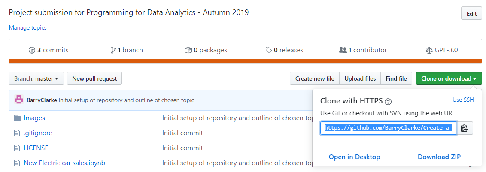

# Programming-for-Data-Analytics-Project-Autumn-2019

## Scope
To simulate a dataset for a real life phenomenon that accurately reflects the values, distributions and relationships of a real dataset for the same phenomenon. 
[See here for instructions](/ProgDA_Project.pdf)

## Desciption
The main body of work in this assignment is performed in a jupyter notebook. If viewing through Github, the ipynb file is best viewed through nbviewer, as certain text formatting will not load correctly when viewing through GitHub. Please follow the below link to view the notebook in nbviewer  [Create a Data Set Project jupyter notebook](https://nbviewer.jupyter.org/github/BarryClarke/Create-a-Data-set-Project-Autumn-2019/blob/master/New%20Electric%20car%20sales.ipynb) 

To view the source code in jupyter notebook, please follow the below instructions:
1. In this repoistory (ie Create-a-Data-set-Project-Autumn-2019) click on the clone or download button and copy the URL 
2. In cmder/command prompt on your system clone the repository using the command git clone followed by paste the URL
3. Go to the directory where you saved cloned the Repository
4. Type "jupyter notebook" for the repository to open in jupyter
5. When Jupyter notebook opens, click on the numpy.random package.ipynb file
6. In this file, locate the *Kernal* tab and select *Restart & Run All*  
**Note:** This assumes you have python and Github setup on your machine. 

